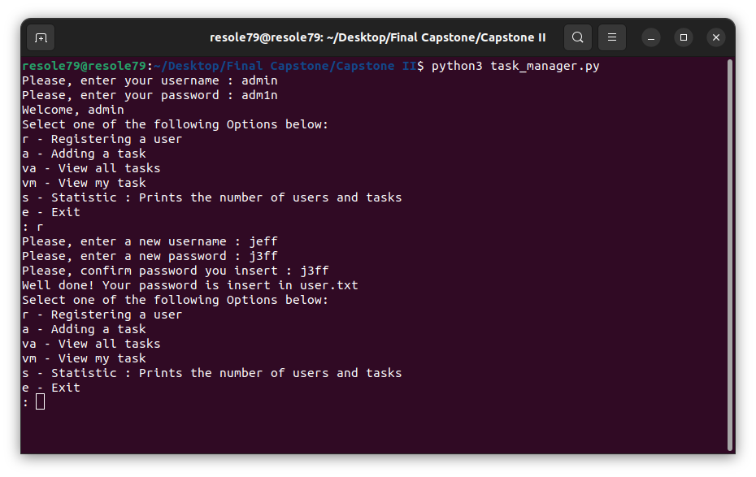
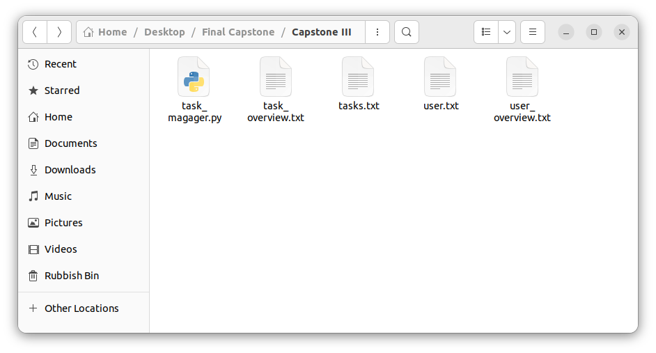

## Task Manager (II Version)

Program for a small business that can help it to manage tasks assigned to each member of the team

#### Prerequisites
You will need the following software to run the task manager:
 - [Python 3](https://www.python.org/downloads/)

#### Installation
To get started with the financial calculators, follow these steps:

1. **Clone** the repository:

```sh
git clone https://github.com/resole79/task_manager_II.git
```

2. **Run** the **task_manager.py** file:

```sh
python task_manager.py
```
#### What's New?   

 - Not dupli usernames 
 - Update file by task as complete, person to whom the task is assigned, or due date
 - Generate Reports
 - Display Statistics
 

#### File Structure   
 - **task_manager.py**: Main program.
 - **user.txt**: stores the username and password for each user that has permission to use your program.  
The username and password for each user must be written to this file in the following format:   
First, the username followed by a comma, a space and then the password.
One username and corresponding password per line.
 - **tasks.txt**: stores a list of all the tasks that the team is working on.  
Each line includes the following data about a task in this order:  
The *username* of the person to whom the task is assigned.  
The *title* of the task.  
A *description* of the task.  
The *date* that the task was assigned to the user.  
The *due date* for the task.  
Either a ‘*Yes*’ or ‘*No*’ value that specifies if the task has been completed yet.  
 - **task_overview** : generate by program when user "admin" chooses to generate reports
 - **user_overview** : generate by program when user "admin" chooses to generate reports

#### **Usage**

**How program present**

<p align="center"><br><i>admin menu</i></p>
<p align="center"><br><i>user menu</i></p>

**User *'admin'* selects *‘r’* to register a user**

Ask the user to input:
 - New username and password.
 - Confirm the password. 
 

<p align="center"><br><i>admin selects “r”</i></p>


**User *'admin'* selects *‘a’* to to add a task**

Ask the user to input:
 - Username of the person the task is assigned
 - The title of the task
 - A description of the task
 - The due date of the task

<p align="center"><br><i>admin selects “a”</i></p>


**User *'admin'* selects *‘va’* to view all tasks**

<p align="center"><br><i>admin selects “va”</i></p>


**User *'admin'* selects *‘vm’* to view the tasks that are assigned to them**

<p align="center"><br><i>admin selects “vm”</i></p>


**User *'admin'* selects *‘gs’* to generate statistics.**
<p align="center"><br></p>

<p align="center"><br><i>admin selects “gs”</i></p>


**User *'admin'* selects *‘ds’* to display statistics.**

<p align="center"><br><i>admin selects “ds”</i></p>


## **Credit**

Author : Emilio Reforgiato (resole79)

##
<p align="right"><a href="https://www.linkedin.com/in/emilio-reforgiato/" target=”_blank” ></a></p>


---


